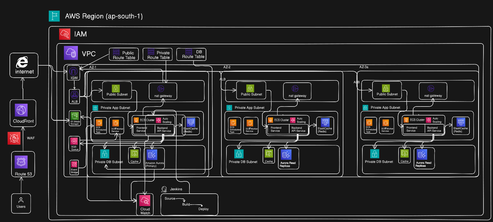

# 🎬 aws-streaming-platform - Production-Grade Streaming Platform Infrastructure

[](https://www.terraform.io/)
[](https://aws.amazon.com/)
[](LICENSE)
[](https://github.com/your-username/repo-name)

> Enterprise-grade Infrastructure as Code (IaC) for a scalable, highly-available streaming platform built on AWS using Terraform. Designed to handle millions of concurrent users with sub-second latency.

---

## 📋 Table of Contents

- [Architecture Overview](#-architecture-overview)
- [Features](#-features)
- [Infrastructure Components](#-infrastructure-components)
- [Prerequisites](#-prerequisites)
- [Quick Start](#-quick-start)
- [Module Documentation](#-module-documentation)
- [Cost Optimization](#-cost-optimization)
- [Security Best Practices](#-security-best-practices)
- [CI/CD Integration](#-cicd-integration)
- [Monitoring & Observability](#-monitoring--observability)
- [Disaster Recovery](#-disaster-recovery)
- [Troubleshooting](#-troubleshooting)
- [Contributing](#-contributing)
- [License](#-license)

---

## 🏗️ Architecture Overview

<!-- Infrastructure Diagram Placeholder -->

*High-level architecture diagram showcasing the complete AWS infrastructure stack*

### Architecture Highlights

- **Multi-AZ Deployment**: High availability across 3 availability zones in `ap-south-1` (Mumbai)
- **Microservices Architecture**: Containerized services running on ECS Fargate
- **Global Content Delivery**: CloudFront CDN with S3 origin for low-latency media streaming
- **Auto-Scaling**: Dynamic scaling based on CPU/memory utilization
- **Zero-Downtime Deployments**: Blue-green deployment strategy with ALB
- **Serverless Components**: EventBridge + Lambda for scheduled tasks
- **Secure by Design**: Private subnets, security groups, encryption at rest and in transit

---

## ✨ Features

### 🚀 Performance & Scalability
- **Auto-scaling ECS Services**: Scales from 2 to 10 tasks based on demand
- **CloudFront CDN**: Global edge caching for media assets
- **ElastiCache Redis**: Sub-millisecond response times for session data
- **Multi-AZ NAT Gateways**: High availability for outbound internet traffic

### 🔒 Security & Compliance
- **OIDC-based CI/CD**: GitHub Actions integration without long-lived credentials
- **Encryption Everywhere**: KMS encryption for SQS, RDS, S3, and Redis
- **Network Isolation**: Private subnets for application and database tiers
- **Least Privilege IAM**: Separate execution and task roles with minimal permissions

### 📊 Observability
- **CloudWatch Container Insights**: Real-time ECS metrics and logs
- **Custom CloudWatch Alarms**: CPU, 5XX errors, and database performance monitoring
- **Centralized Logging**: All application logs aggregated in CloudWatch Log Groups
- **30-Day Log Retention**: Configurable retention policies for compliance

### 💰 Cost Optimization
- **Aurora Serverless v2**: Pay-per-use database with automatic scaling (0.5 - 4 ACU)
- **S3 Lifecycle Policies**: Automatic archival to Glacier after 90 days
- **Spot Instances Ready**: Infrastructure supports Fargate Spot for 70% cost savings
- **Resource Tagging**: Comprehensive tagging for cost allocation and tracking

---

## 🧩 Infrastructure Components

| Component | Service | Purpose |
|-----------|---------|---------|
| **Compute** | ECS Fargate | Serverless container orchestration |
| **Load Balancing** | Application Load Balancer | Traffic distribution and health checks |
| **Networking** | VPC, Subnets, NAT Gateway | Network isolation and internet access |
| **Database** | RDS PostgreSQL | Primary relational database |
| **Cache** | ElastiCache Redis | Session management and caching |
| **Storage** | S3 | Media asset storage |
| **CDN** | CloudFront | Global content delivery |
| **DNS** | Route53 | Domain management |
| **Messaging** | SQS + DLQ | Asynchronous task processing |
| **Scheduling** | EventBridge | Cron-based task triggers |
| **Secrets** | AWS Secrets Manager | Credential management |
| **Monitoring** | CloudWatch | Metrics, logs, and alarms |
| **IAM** | IAM Roles & Policies | Identity and access management |

---

## 📦 Prerequisites

### Required Tools
```bash
# Terraform
terraform >= 1.6.0

# AWS CLI
aws-cli >= 2.0

# Git
git >= 2.0
```

### AWS Account Setup
- AWS Account with administrative access
- AWS CLI configured with appropriate credentials
- S3 bucket for Terraform state (pre-created)
- DynamoDB table for state locking (pre-created)

### Required AWS Resources (Pre-requisites)
```bash
# Create S3 bucket for Terraform state
aws s3api create-bucket \
  --bucket aws-terraform-state-prod \
  --region ap-south-1 \
  --create-bucket-configuration LocationConstraint=ap-south-1

# Create DynamoDB table for state locking
aws dynamodb create-table \
  --table-name terraform-state-lock \
  --attribute-definitions AttributeName=LockID,AttributeType=S \
  --key-schema AttributeName=LockID,KeyType=HASH \
  --billing-mode PAY_PER_REQUEST \
  --region ap-south-1
```

---

## 🚀 Quick Start

### 1️⃣ Clone the Repository
```bash
git clone https://github.com/your-username/aws-streaming-platform-terraform.git
cd aws-streaming-platform-terraform
```

### 2️⃣ Configure Variables
```bash
# Copy the example tfvars file
cp terraform.tfvars.example terraform.tfvars

# Edit with your values
vim terraform.tfvars
```

**Key Variables to Configure:**
```hcl
environment  = "prod"
aws_region   = "ap-south-1"
project_name = "streaming-pro"

# Update with your ECR image URIs
frontend_image = "YOUR_ACCOUNT.dkr.ecr.ap-south-1.amazonaws.com/frontend:latest"
backend_image  = "YOUR_ACCOUNT.dkr.ecr.ap-south-1.amazonaws.com/backend:latest"

# Update with your domain
domain_name = "yourdomain.com"

# Update with your GitHub details
github_org  = "your-github-org"
github_repo = "your-repo-name"
```

### 3️⃣ Initialize Terraform
```bash
terraform init
```

### 4️⃣ Review the Plan
```bash
terraform plan -out=tfplan
```

### 5️⃣ Apply Infrastructure
```bash
terraform apply tfplan
```

### 6️⃣ Get Outputs
```bash
terraform output
```

---

## 📚 Module Documentation

### VPC Module (`modules/vpc`)
**Purpose**: Creates the network foundation with public and private subnets across 3 AZs.

**Resources Created**:
- 1 VPC with DNS support enabled
- 3 Public subnets (for ALB and NAT Gateways)
- 3 Private app subnets (for ECS tasks)
- 3 Private DB subnets (for RDS and Redis)
- 3 NAT Gateways with Elastic IPs
- Route tables and associations
- DB subnet group

**Key Features**:
- Multi-AZ for high availability
- Separate subnet tiers for security
- One NAT Gateway per AZ (no single point of failure)

---

### ECS Module (`modules/ecs`)
**Purpose**: Manages containerized workloads using ECS Fargate.

**Resources Created**:
- ECS Cluster with Container Insights
- Application Load Balancer (Internet-facing)
- Target Groups for frontend/backend
- ECS Task Definitions
- ECS Services with auto-scaling
- Security Groups
- CloudWatch Log Groups

**Scaling Configuration**:
- Min Tasks: 2
- Max Tasks: 10
- Target CPU: 70%

---

### Database Module (`modules/database`)
**Purpose**: Provides managed relational database and in-memory caching.

**Resources Created**:
- RDS PostgreSQL instance (db.t3.micro)
- ElastiCache Redis cluster (2 nodes, Multi-AZ)
- Security groups for database access
- Subnet groups

**Features**:
- Automatic failover for Redis
- Encryption at rest and in transit
- Automated backups (RDS)

---

### CDN Module (`modules/cdn`)
**Purpose**: Delivers static content globally with low latency.

**Resources Created**:
- S3 bucket for media storage
- CloudFront distribution with OAC
- Route53 hosted zone
- DNS records

**Features**:
- Origin Access Control (OAC) for secure S3 access
- Dual origins (S3 for media, ALB for API)
- Lifecycle policies (S3 → Glacier after 90 days)

---

### Security Module (`modules/security`)
**Purpose**: Manages IAM roles, OIDC, and monitoring.

**Resources Created**:
- ECS task execution role
- ECS task role
- GitHub Actions OIDC provider
- CloudWatch alarms (CPU, 5XX errors, RDS CPU)

**OIDC Integration**:
- Keyless authentication for GitHub Actions
- Scoped to specific repository

---

### Async Module (`modules/async`)
**Purpose**: Handles asynchronous workloads and scheduled tasks.

**Resources Created**:
- SQS queue with Dead Letter Queue (DLQ)
- EventBridge rule for scheduled tasks
- IAM role for EventBridge → ECS

**Use Cases**:
- Batch video transcoding
- Nightly database maintenance
- Report generation

---

## 💰 Cost Optimization

### Estimated Monthly Cost (Production)
| Service | Configuration | Estimated Cost |
|---------|---------------|----------------|
| ECS Fargate | 2-10 tasks (0.25 vCPU, 0.5GB) | $30 - $150 |
| ALB | 1 ALB + data processing | $25 |
| NAT Gateway | 3 NAT Gateways + data transfer | $100 |
| RDS PostgreSQL | db.t3.micro (20GB storage) | $15 |
| ElastiCache Redis | cache.t3.micro (2 nodes) | $25 |
| S3 + CloudFront | 1TB storage + 5TB transfer | $50 |
| **Total** | | **~$245 - $365/month** |

### Cost-Saving Tips
1. **Use Fargate Spot** for non-critical workloads (70% savings)
2. **Reserved Instances** for RDS if usage is predictable
3. **S3 Intelligent-Tiering** instead of manual lifecycle policies
4. **Single NAT Gateway** for dev/staging environments
5. **CloudWatch Log Insights** retention tuning (7 days for dev)

---

## 🔐 Security Best Practices

### Network Security
- ✅ Private subnets for application and database tiers
- ✅ Security groups with principle of least privilege
- ✅ No direct internet access for ECS tasks (via NAT Gateway)
- ✅ VPC Flow Logs enabled (optional, uncomment in code)

### Data Security
- ✅ Encryption at rest (RDS, Redis, S3, SQS)
- ✅ Encryption in transit (TLS 1.2+)
- ✅ KMS customer-managed keys for SQS
- ✅ S3 bucket public access blocked

### Access Control
- ✅ IAM roles with minimal permissions
- ✅ OIDC for CI/CD (no long-lived credentials)
- ✅ Secrets Manager for database credentials (recommended)
- ✅ MFA enforcement for AWS console access (manual)

### Compliance
- ✅ CloudTrail logging (enable separately)
- ✅ Config rules for compliance checks (optional)
- ✅ Resource tagging for audit trails

---

## 🔄 CI/CD Integration

### GitHub Actions Integration

**1. Add AWS Credentials to GitHub Secrets**
```yaml
# .github/workflows/deploy.yml
name: Deploy to Production

on:
  push:
    branches: [main]

jobs:
  deploy:
    runs-on: ubuntu-latest
    permissions:
      id-token: write
      contents: read
    
    steps:
      - uses: actions/checkout@v3
      
      - name: Configure AWS Credentials
        uses: aws-actions/configure-aws-credentials@v2
        with:
          role-to-assume: ${{ secrets.AWS_ROLE_ARN }}
          aws-region: ap-south-1
      
      - name: Login to Amazon ECR
        id: login-ecr
        uses: aws-actions/amazon-ecr-login@v1
      
      - name: Build and Push Docker Image
        env:
          ECR_REGISTRY: ${{ steps.login-ecr.outputs.registry }}
          IMAGE_TAG: ${{ github.sha }}
        run: |
          docker build -t $ECR_REGISTRY/frontend:$IMAGE_TAG .
          docker push $ECR_REGISTRY/frontend:$IMAGE_TAG
      
      - name: Update ECS Service
        run: |
          aws ecs update-service \
            --cluster cluster-prod \
            --service frontend-service \
            --force-new-deployment
```

**2. Required GitHub Secrets**
- `AWS_ROLE_ARN`: Output from `terraform output cicd_iam_role_arn`

---

## 📊 Monitoring & Observability

### CloudWatch Dashboards
```bash
# View ECS metrics
aws cloudwatch get-dashboard --dashboard-name "ECS-Prod-Dashboard"

# View logs
aws logs tail /ecs/prod/logs --follow
```

### Key Metrics to Monitor
- **ECS Service CPU/Memory**: Target < 70%
- **ALB 5XX Error Rate**: Target < 1%
- **RDS CPU Utilization**: Target < 80%
- **Redis Cache Hit Ratio**: Target > 95%

### Alarms Configured
1. **ecs-cpu-utilization-high**: Triggers when ECS CPU > 85%
2. **alb-high-5xx-errors**: Triggers when 5XX count > 10/min
3. **rds-cpu-utilization-high**: Triggers when RDS CPU > 80%

---

## 🛡️ Disaster Recovery

### Backup Strategy
- **RDS**: Automated backups with 7-day retention
- **S3**: Versioning enabled + Glacier archival
- **Terraform State**: Versioned S3 bucket with locking

### Recovery Procedures

**Scenario 1: Complete Region Failure**
```bash
# Update region in terraform.tfvars
aws_region = "ap-south-2"

# Re-deploy infrastructure
terraform init -reconfigure
terraform apply
```

**Scenario 2: Accidental Resource Deletion**
```bash
# Import existing resource
terraform import aws_ecs_cluster.this cluster-prod

# Restore from state file
terraform apply
```

**Scenario 3: Database Corruption**
```bash
# Restore from automated backup
aws rds restore-db-instance-from-db-snapshot \
  --db-instance-identifier restored-db \
  --db-snapshot-identifier rds:prod-2024-01-15
```

---

## 🐛 Troubleshooting

### Common Issues

#### Issue 1: ECS Tasks Failing to Start
**Symptom**: Tasks stuck in "PENDING" state

**Solution**:
```bash
# Check CloudWatch logs
aws logs tail /ecs/prod/logs --follow

# Common causes:
# - Insufficient memory/CPU allocation
# - Image pull errors (check ECR permissions)
# - Security group blocking traffic
```

#### Issue 2: ALB Health Checks Failing
**Symptom**: Targets marked as unhealthy

**Solution**:
```bash
# Verify health check endpoint
curl http://<alb-dns-name>/health

# Check security group rules
aws ec2 describe-security-groups --group-ids sg-xxxxx

# Update health check path if needed
terraform apply -var="health_check_path=/api/health"
```

#### Issue 3: High RDS CPU Usage
**Symptom**: Database performance degradation

**Solution**:
```bash
# Identify slow queries
aws rds describe-db-log-files --db-instance-identifier prod-db

# Scale up instance class
# Update modules/database/main.tf:
instance_class = "db.t3.small"

terraform apply
```

---

## 🤝 Contributing

We welcome contributions! Please follow these guidelines:

1. **Fork the repository**
2. **Create a feature branch**: `git checkout -b feature/amazing-feature`
3. **Commit your changes**: `git commit -m 'Add amazing feature'`
4. **Push to branch**: `git push origin feature/amazing-feature`
5. **Open a Pull Request**

### Code Standards
- Follow HashiCorp's Terraform style guide
- Add comments for complex logic
- Update documentation for new modules
- Test changes in a dev environment first

---

## 📄 License

This project is licensed under the MIT License - see the [LICENSE](LICENSE) file for details.

---

**⭐ If you find this project helpful, please consider giving it a star!**
